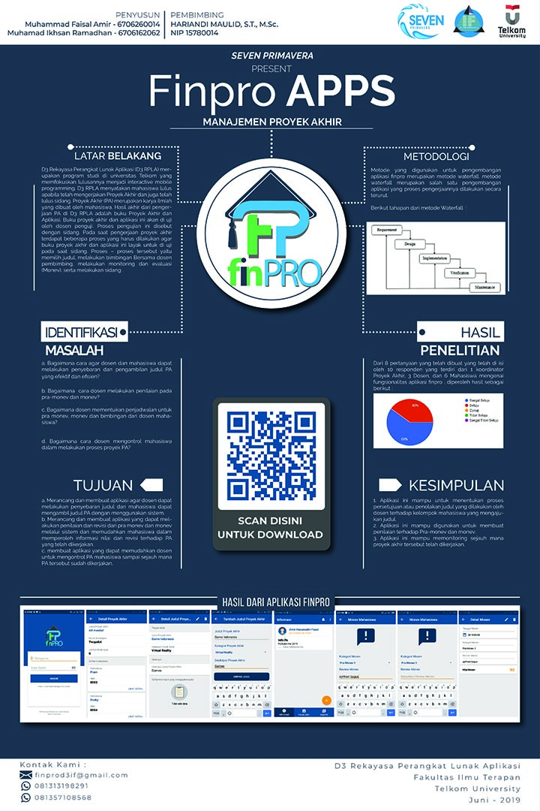

# Finpro (Final Project)
- Finpro - An Android Based Final Project Management System
- Final Project Management D3RPLA / D3IF Telkom University 2019

# Copyright
- Program Studi D3 Rekayasa Perangkat Lunak Aplikasi 
- Fakultas Ilmu Terapan
- Universitas Telkom
- Bandung 2019 

# Android Library Version (build.gradle)
- classpath 'com.android.tools.build:gradle:4.1.2'
- compileSdkVersion 30
- buildToolsVersion "30.0.3"
- minSdkVersion 21

# Version Release
This Is Latest Release

    $version_release = 1.0

# Keywords
- Final Project 
- Finpro 
- Android based application
- Guidance

# Contributor
<h3>Android</h3>
- Muhammad Faisal Amir 
- Muhamad Ikhsan Ramadhan - https://github.com/ikhsanramadhaan

<h3>Website CMS - Laravel</h3>
- Bryan Rafsanzani - https://github.com/bryanrafsanzani 
- Rivkal Sukma Sanjaya - https://github.com/Rivkalsanjaya

<h3>Who Supported This Project (All lecturers of D3IF Telkom University)</h3>
- Rahmadi Wijaya, S.Si., M.T. (Head of Study Program) 
- Hariandi Maulid , S.T., M.Sc (Advisor 1) 
- Amir Hasanudin Fauzi, S.T., M.T. 
- Fat'hah Noor Prawita, S.T., M.T. 
- Hariandi Maulid, S.T., M.Sc. 
- Hetti Hidayati, S.Kom., M.T. 
- Indra Azimi, S.T., M.T. 
- Rizza Indah Mega Mandasari, S.Kom., M.T. 
- Tri Brotoharsono, S.T., M.T.

# Documents Finpro
- Laporan PA - https://github.com/amirisback/Finpro-PA-D3IF-Telkom/blob/master/docs/book/buku_pa_finpro.pdf
- Jurnal PA - https://github.com/amirisback/Finpro-PA-D3IF-Telkom/blob/master/docs/book/jurnal_finpro.pdf
- Slide PA - https://github.com/amirisback/Finpro-PA-D3IF-Telkom/blob/master/docs/book/presentation_finpro.pdf
- User Manual PA - https://github.com/amirisback/Finpro-PA-D3IF-Telkom/blob/master/docs/book/user_manual_finpro.pdf

# Poster Finpro 

# Attention !!!
Please enjoy and don't forget fork and give a star
- Don't Forget Follow My Github Account
