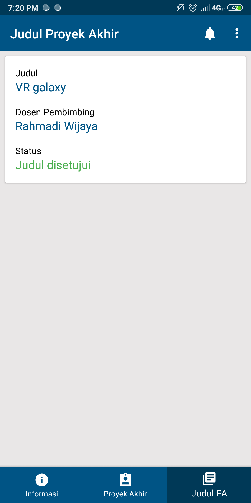
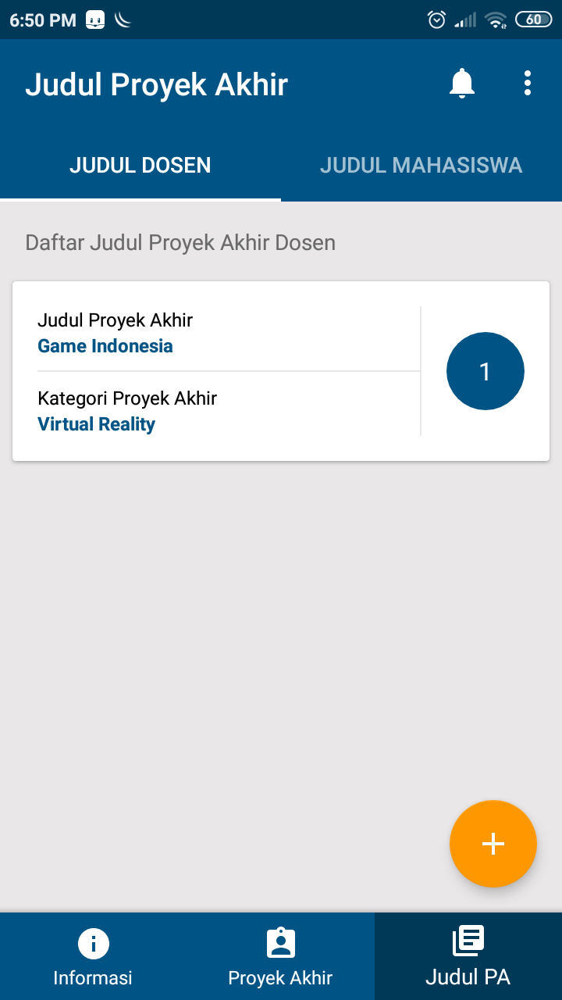
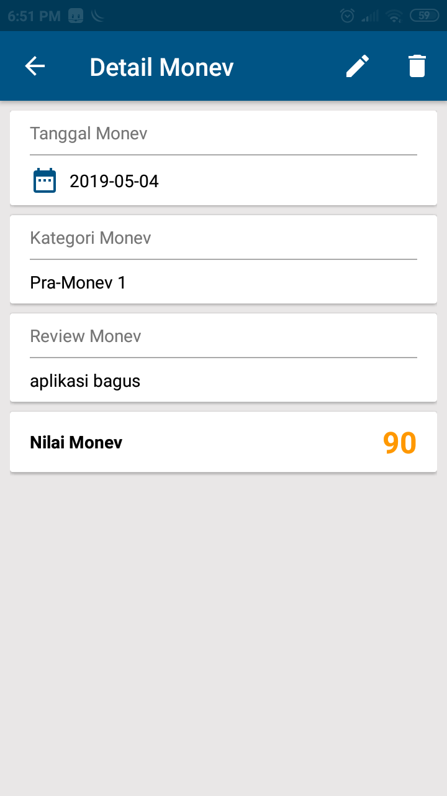
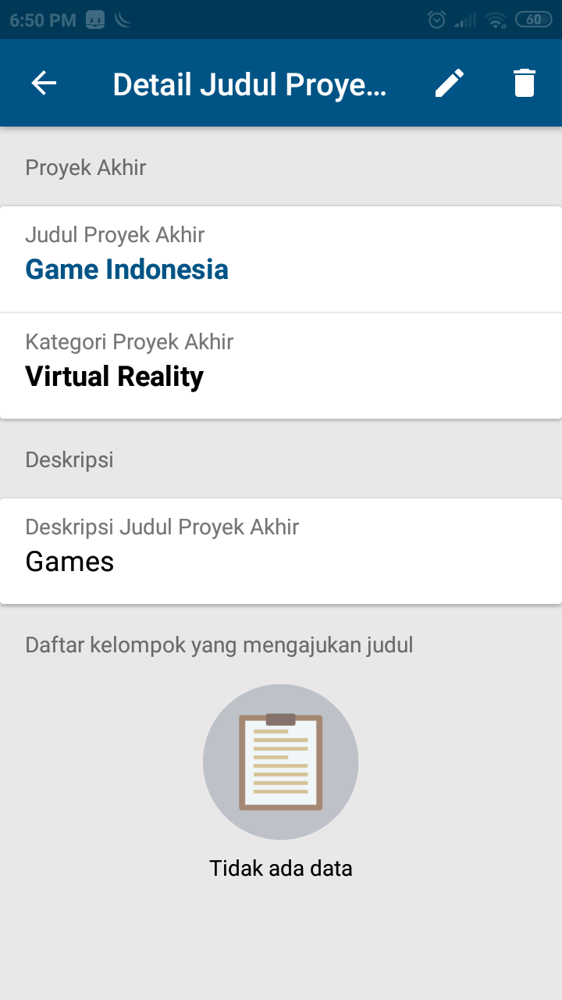
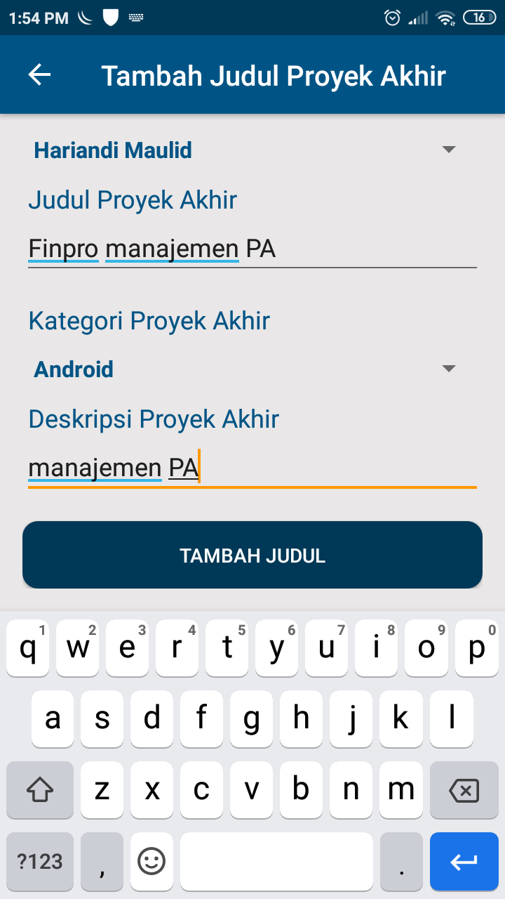
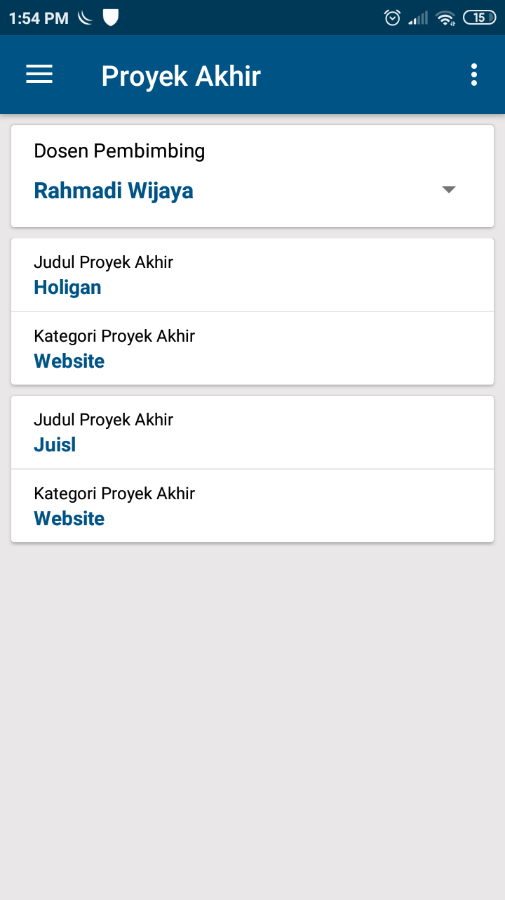
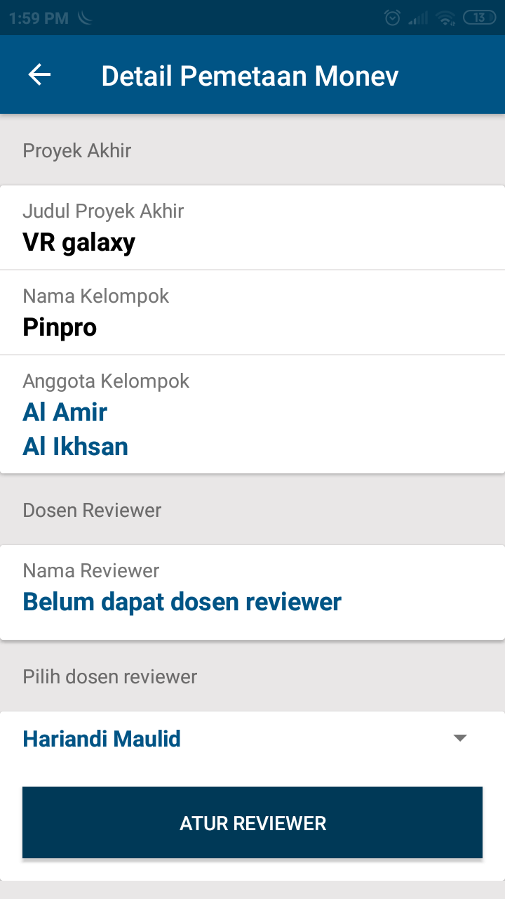

## Finpro (Final Project)
- Finpro - An Android Based Final Project Management System
- Final Project Management D3RPLA / D3IF Telkom University 2019
- Web API [Click Here](https://github.com/amirisback/Finpro-PA-D3IF-Telkom/tree/master/webapp/finpro-laravel)

## Documents Finpro
- Laporan PA [Click Here](https://github.com/amirisback/Finpro-PA-D3IF-Telkom/blob/master/docs/book/buku_pa_finpro.pdf)
- Jurnal PA [Click Here](https://github.com/amirisback/Finpro-PA-D3IF-Telkom/blob/master/docs/book/jurnal_finpro.pdf)
- Slide PA [Click Here](https://github.com/amirisback/Finpro-PA-D3IF-Telkom/blob/master/docs/book/presentation_finpro.pdf)
- User Manual PA [Click Here](https://github.com/amirisback/Finpro-PA-D3IF-Telkom/blob/master/docs/book/user_manual_finpro.pdf)

## Screen shoot

### Mahasiswa [more](https://github.com/amirisback/Finpro-PA-D3IF-Telkom/tree/master/docs/image/mahasiswa)
| UI 1 | UI 2 | UI 3 |
|:----:|:----:|:----:|
| |  |  |

### Dosen [more](https://github.com/amirisback/Finpro-PA-D3IF-Telkom/tree/master/docs/image/dosen)
| UI 1 | UI 2 | UI 3 |
|:----:|:----:|:----:|
| |  |  |

### Admin [more](https://github.com/amirisback/Finpro-PA-D3IF-Telkom/tree/master/docs/image/admin)
| UI 1 | UI 2 | UI 3 |
|:----:|:----:|:----:|
| |  |  |

## Version Release
This Is Latest Release

    $version_release = 1.0

<h3>Who Supported This Project (All lecturers of D3IF Telkom University)</h3>
- Rahmadi Wijaya, S.Si., M.T. (Head of Study Program) 
- Hariandi Maulid , S.T., M.Sc (Advisor 1) 
- Amir Hasanudin Fauzi, S.T., M.T. 
- Fat'hah Noor Prawita, S.T., M.T. 
- Hariandi Maulid, S.T., M.Sc. 
- Hetti Hidayati, S.Kom., M.T. 
- Indra Azimi, S.T., M.T. 
- Rizza Indah Mega Mandasari, S.Kom., M.T. 
- Tri Brotoharsono, S.T., M.T.

## Copyright
- Program Studi D3 Rekayasa Perangkat Lunak Aplikasi
- Fakultas Ilmu Terapan
- Universitas Telkom
- Bandung 2019

## Contributor
<h3>Android</h3>
- Muhammad Faisal Amir 
- Muhamad Ikhsan Ramadhan - https://github.com/ikhsanramadhaan

<h3>Website CMS - Laravel</h3>
- Bryan Rafsanzani - https://github.com/bryanrafsanzani 
- Rivkal Sukma Sanjaya - https://github.com/Rivkalsanjaya

## Photo of Contributor
<table>
    <tr>
    <td align="center"><a href="https://github.com/amirisback"> <b>Muhammad Faisal Amir</b></td>
    <td align="center"><a href="https://github.com/ikhsanramadhaan"> <b>Muhamad Ikhsan Ramadhan</b></td>
    <td align="center"><a href="https://github.com/bryanrafsanzani"> <b>Bryan Rafsanzani</b></td>
    <td align="center"><a href="https://github.com/Rivkalsanjaya"> <b>Rivkal Sukma Sanjaya</b></td>
    </tr>
</table>

## Attention !!!
Please enjoy and don't forget fork and give a star
- Don't Forget Follow My Github Account

